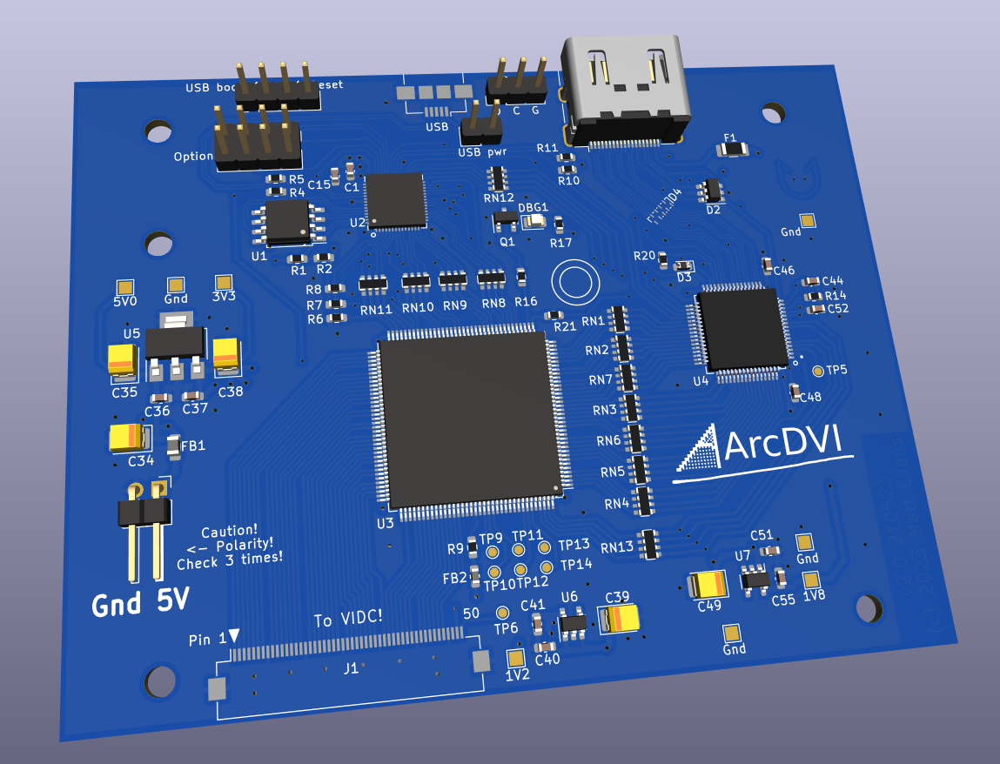

# ArcDVI main board

Kicad 6.0 PCB design for the ArcDVI main board:

This board interfaces via FFC to an ArcDVI VIDC board (either the socket-based interposer for A4xx machines, or the push-on for A3000/A5000).

See <https://stardot.org.uk> for more info.

# License

ArcDVI is copyright 2023 Matt Evans.

This work is licensed under the Creative Commons Attribution-NonCommercial-ShareAlike 3.0 Unported License. To view a copy of this license, visit http://creativecommons.org/licenses/by-nc-sa/3.0/ or send a letter to Creative Commons, PO Box 1866, Mountain View, CA 94042, USA.
